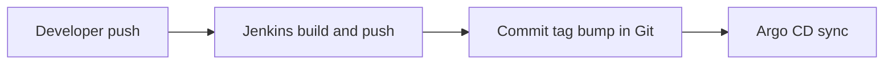

# k8s-lab

Local Kubernetes lab on **VirtualBox** and **Vagrant**: a **k3s** control plane and workers, plus a **runner-ci** VM that runs Jenkins, an insecure container registry, Helm-based installs for observability (Prometheus, Grafana, Loki), Headlamp, Argo CD, and (after the first Jenkins build) a Spring AI **MCP server** for tools like Cursor. Cluster state is GitOps-driven from this repository; CI never applies manifests with `kubectl` directly.

## Architecture

- **GitOps / CI:** Jenkins builds images, pushes to the local registry, updates image tags in this repository, and pushes; Argo CD watches the repo and syncs manifests under `k8s/` to the cluster.



- **Ingress:** Traffic from your Mac hits a **MetalLB** virtual IP, then the **NGINX Ingress Controller**, which routes by hostname (for example `grafana.k8s.lab`, `argocd.k8s.lab`). See [vm-setup/VM_README.md](vm-setup/VM_README.md#networking) for the full picture.

## VMs

| VM | Hostname | IP | RAM | CPUs | Role |
| -- | -------- | -- | --- | ---- | ---- |
| `k3s-master` | k3s-master | 192.168.56.11 | 3072 MB | 2 | k3s control plane |
| `k3s-worker1` | k3s-worker1 | 192.168.56.12 | 2048 MB | 1 | k3s worker |
| `k3s-worker2` | k3s-worker2 | 192.168.56.13 | 2048 MB | 1 | k3s worker |
| `runner-ci` | runner-ci | 192.168.56.10 | 4096 MB | 2 | Jenkins, registry, Helm deploys, MCP host |

## Prerequisites

- [Vagrant](https://www.vagrantup.com/) ≥ 2.3
- [VirtualBox](https://www.virtualbox.org/) ≥ 7.0
- A GitHub PAT with read access to the app repos and write access to this repo (see [VM_README — Jenkins CI](vm-setup/VM_README.md#jenkins-ci) for `GITHUB_PAT` and other environment variables)

## Quick start

```bash
cd vm-setup
vagrant up
```

Provisioning order: `k3s-master` → `k3s-worker1` → `k3s-worker2` → `runner-ci`. The first full bring-up can take a while while images and charts are pulled.

## macOS host: DNS for `.k8s.lab`

Browsers on your Mac need the ingress hostnames to resolve to the MetalLB VIP. Add this line to `/etc/hosts` (or run the one-liner below):

```bash
sudo sh -c 'echo "192.168.56.200 grafana.k8s.lab headlamp.k8s.lab argocd.k8s.lab app.k8s.lab" >> /etc/hosts'
```

Manual line:

```
192.168.56.200 grafana.k8s.lab headlamp.k8s.lab argocd.k8s.lab app.k8s.lab
```

## Service URLs

| Service | URL |
| ------- | --- |
| Jenkins | [http://192.168.56.10:8080](http://192.168.56.10:8080) |
| Grafana | [http://grafana.k8s.lab](http://grafana.k8s.lab) |
| Headlamp | [http://headlamp.k8s.lab](http://headlamp.k8s.lab) |
| Argo CD | [http://argocd.k8s.lab](http://argocd.k8s.lab) |
| MCP (Cursor, streamable HTTP) | `http://192.168.56.10:9000/mcp` — configure in `~/.cursor/mcp.json`; first deploy via Jenkins **mcp-server** job. Server source and tool docs: [nilslee/k8s-lab-mcp](https://github.com/nilslee/k8s-lab-mcp). Lab wiring: [VM_README — MCP Server](vm-setup/VM_README.md#mcp-server). |

Default Grafana login is **admin / admin** (change in production-style use). Jenkins admin password: see the VM guide.

## Repository layout

| Path | Contents |
| ---- | -------- |
| [k8s/](k8s/) | Hosted application manifests (namespaces, app Kustomize) |
| [argocd/](argocd/) | Argo CD Helm values, ingress, Application CRs |
| [jenkins/](jenkins/) | JCasC, plugins, pipelines |
| [monitoring/](monitoring/), [dashboard/](dashboard/), [networking/](networking/) | Helm values and related manifests |
| [vm-setup/](vm-setup/) | `Vagrantfile`, provisioning scripts, [VM_README.md](vm-setup/VM_README.md) |

The MCP server runs in the `runner-ci` VM and is a separate codebase: **[github.com/nilslee/k8s-lab-mcp](https://github.com/nilslee/k8s-lab-mcp)**.

## Full documentation

Provisioning details, Jenkins credentials, useful `vagrant` / `kubectl` commands, and redeploy procedures: **[vm-setup/VM_README.md](vm-setup/VM_README.md)**.
